# RTESArenaAssist — 基本操作ガイド

RTESArenaAssist は、The Elder Scrolls: Arena を遊ぶときに、翻訳、マップ、ジャーナル、ログ、セーブ管理、キャプチャ、辞書、マニュアルを補助表示するアプリです。

対象は `v0.1.5` 時点の Assist アプリです。スクリーンショットはテーマ「ダーク」で撮影しています。

基本的な使い方は、Arena を起動して Assist で接続し、`⊞` ボタンからレイアウトモードに入って遊ぶ流れです。レイアウトモードでは、DOSBox のゲーム画面と Assist の翻訳・マップ・各タブを同じ画面内に並べられるため、Alt+Tab で切り替えずに確認できます。

設定項目の詳細は [設定ダイアログ詳細ガイド](assist_settings_dialog.md) を参照してください。

---

## 目次

- [初回起動](#初回起動)
  - [言語を選ぶ](#言語を選ぶ)
  - [Arena フォルダを指定する](#arena-フォルダを指定する)
  - [翻訳ファイルを生成する](#翻訳ファイルを生成する)
- [基本画面](#基本画面)
  - [未接続状態](#未接続状態)
  - [接続状態](#接続状態)
- [レイアウトモードを基本に使う](#レイアウトモードを基本に使う)
- [各タブ](#各タブ)
  - [翻訳タブ](#翻訳タブ)
  - [ステータスタブ](#ステータスタブ)
  - [マップタブ](#マップタブ)
  - [ジャーナルタブ](#ジャーナルタブ)
  - [ログタブ](#ログタブ)
  - [セーブタブ](#セーブタブ)
  - [キャプチャタブ](#キャプチャタブ)
  - [辞書タブ](#辞書タブ)
  - [マニュアルタブ](#マニュアルタブ)
- [基本的な使用手順](#基本的な使用手順)

---

## 初回起動

公開版は Arena の原文データを同梱しません。初回起動時に、ユーザーの Arena フォルダから翻訳用ファイルを生成します。

### 言語を選ぶ

最初に Assist の表示言語を選びます。選択した言語は、この画面上ですぐに反映されます。

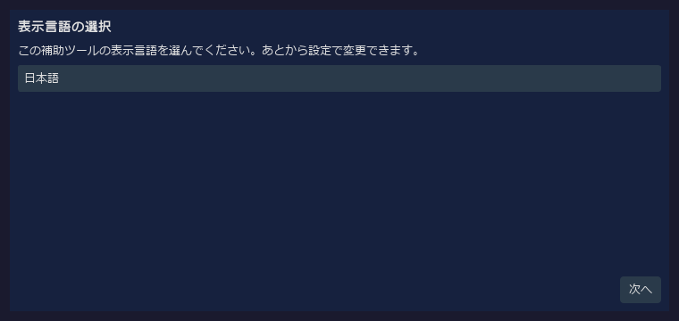

| 操作 | 説明 |
|------|------|
| 言語プルダウン | Assist の UI 言語を選びます。 |
| 次へ | Arena フォルダ指定へ進みます。 |

### Arena フォルダを指定する

Arena を起動した状態で進めると、Assist が実行中の Arena からインストール先を自動検出します。自動検出できない場合は、`参照...` で Arena のデータフォルダを指定します。

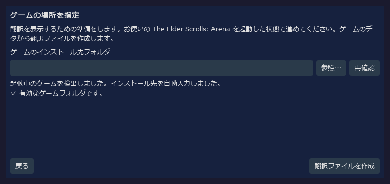

| 項目 | 説明 |
|------|------|
| ゲームのインストール先フォルダ | Arena の `ARENA` フォルダを指定します。 |
| 参照... | フォルダ選択ダイアログから Arena フォルダを指定します。 |
| 再確認 | 起動中の Arena を再検出します。 |
| 翻訳ファイルを作成 | 有効な Arena フォルダが見つかったら、翻訳ファイル生成へ進みます。 |

### 翻訳ファイルを生成する

Arena フォルダのデータから Assist 用の翻訳ファイルを生成します。完了すると本体画面へ進みます。

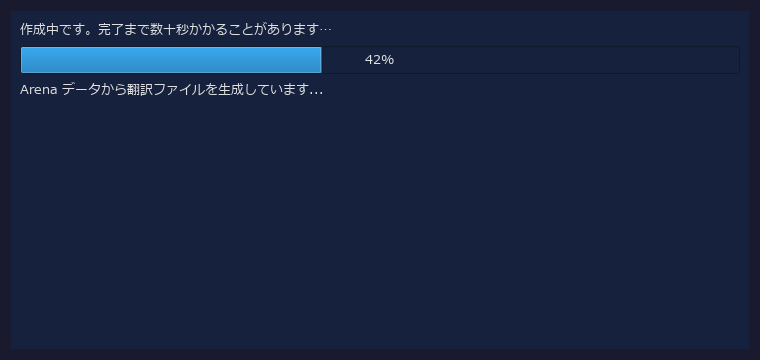

---

## 基本画面

Assist の上部には接続バー、中央にはタブ領域、下部にはステータスバーがあります。

### 未接続状態

起動直後は未接続です。Arena / DOSBox を起動した状態で、右上の `接続` ボタンを押します。

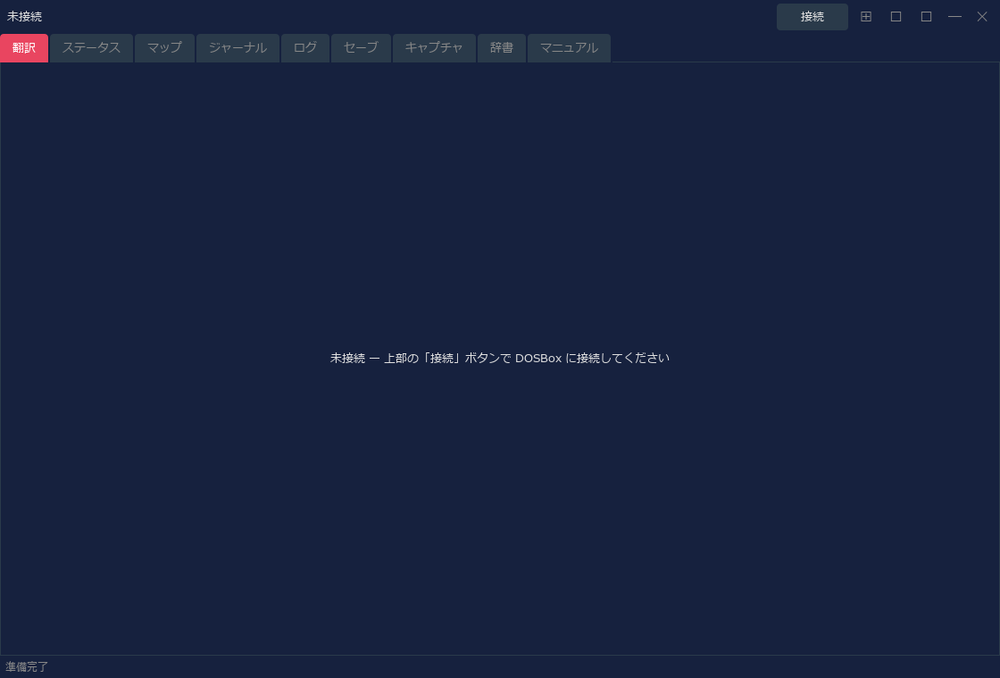

| 領域 | 説明 |
|------|------|
| 接続状態 | 未接続、接続中の画面名、IMG 名などを表示します。 |
| 接続 / 切断 | DOSBox 内の Arena へ接続、または接続解除します。 |
| `⊞` | レイアウトモードを切り替えます。右クリックで配置メニューを開きます。 |
| `📷` | スクリーンショットを保存します。レイアウトモード中はレイアウト全体を1枚で保存します。 |
| `⚙` | 設定ダイアログを開きます。 |

### 接続状態

接続すると、接続バーに認識中の画面名と IMG 名が表示されます。下の例は Arena のタイトル画面に接続している状態です。

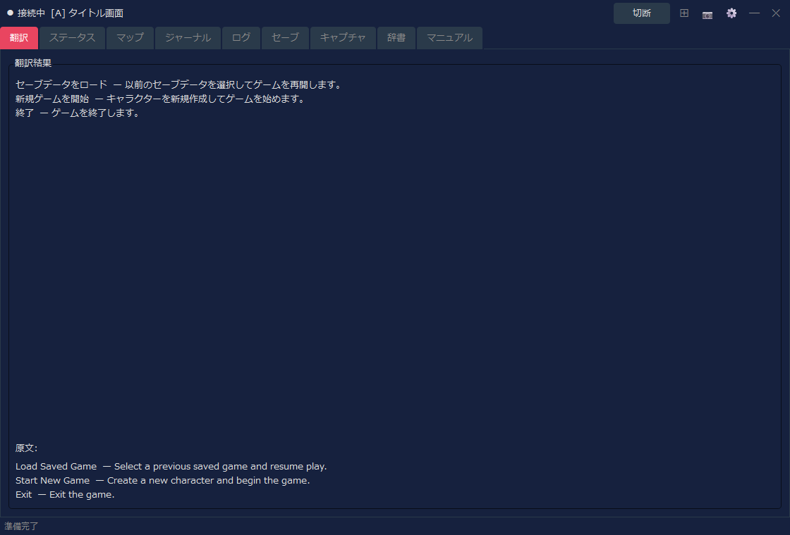

---

## レイアウトモードを基本に使う

Assist は、基本的にレイアウトモードで使うことを想定しています。通常ウィンドウのままでも各タブは使えますが、レイアウトモードにするとゲーム画面、翻訳、マップ、ログなどを同じ画面に固定して確認できます。

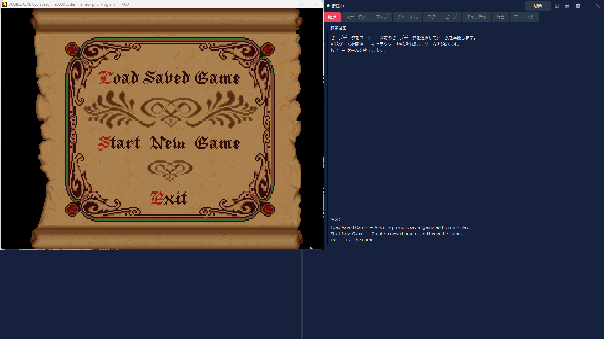

既定のレイアウトでは、左側に DOSBox のゲーム画面、右側に Assist のメインタブ、下部に補助パネルが配置されます。ゲーム中は、右側でマップやジャーナルを確認しながら、下部や翻訳タブで現在画面の翻訳を確認できます。

| 操作 | 説明 |
|------|------|
| `⊞` を左クリック | レイアウトモードの開始 / 終了を切り替えます。 |
| `⊞` を右クリック | 配置形式、配置コーナー、追従モード、再配置、最前面表示などを選べます。 |
| `📷` | レイアウトモード中は、DOSBox と Assist を含むレイアウト全体を1枚の画像として保存します。 |
| `切断` | Arena との接続を解除します。レイアウトモードを終了してから切断すると画面整理がしやすくなります。 |

---

## 各タブ

各タブのスクリーンショットは画面構成を確認するためのものです。接続中は、Arena の現在画面やゲーム内状態に応じて表示内容が更新されます。

### 翻訳タブ

現在の画面に対応する翻訳を表示する中心的なタブです。タイトル画面、キャラクター作成、会話、施設、アイテム、呪文など、状況に応じて表示が切り替わります。

| 表示内容 | 説明 |
|----------|------|
| 翻訳結果 | 現在画面やイベントの日本語訳を表示します。 |
| 原文 | 設定に応じて、対応する英語原文も表示します。 |
| 専用表示 | クラス一覧、種族一覧、装備、施設一覧、購入一覧などは専用の見やすい表示へ切り替わります。 |

### ステータスタブ

キャラクターの能力値や状態を確認するタブです。キャラクター作成後、またはゲーム中に接続していると、ステータス情報が表示されます。

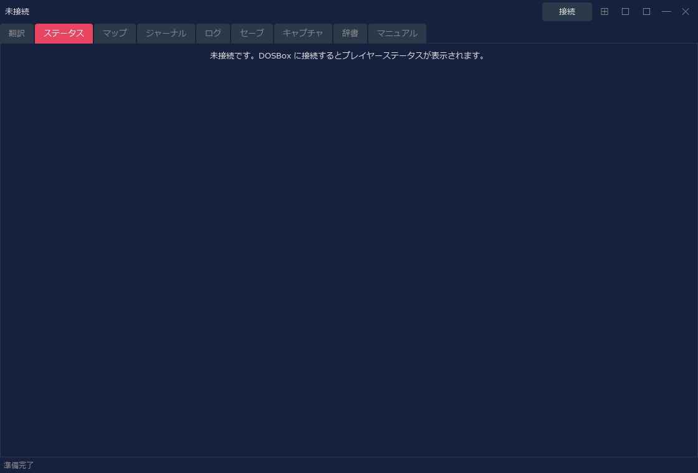

| 表示内容 | 説明 |
|----------|------|
| 能力値 | Strength、Intelligence などの主要能力値を確認できます。 |
| 状態値 | HP、疲労、呪文ポイントなどを確認できます。 |
| 変更操作 | チート設定を明示的に有効にした場合のみ、能力値変更などの操作が使えます。 |

### マップタブ

ダンジョン、街、フィールド、室内などの自動マップを表示します。ゲーム内の現在地に合わせて表示が更新されます。

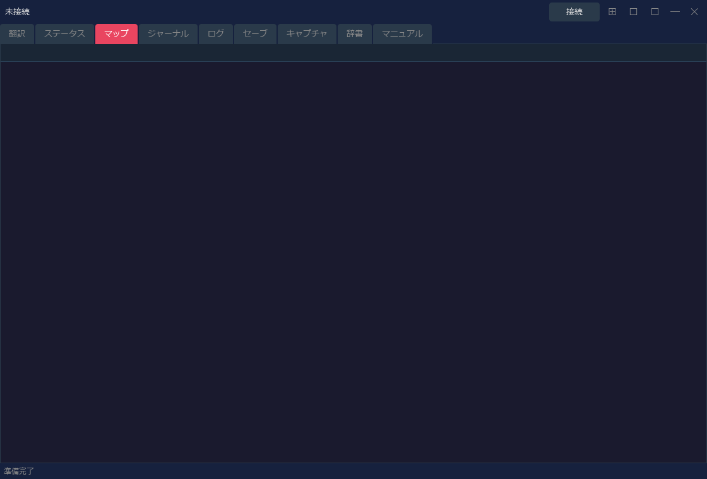

| 表示内容 | 説明 |
|----------|------|
| 現在地表示 | 接続中のゲーム状態から、現在のマップや位置を表示します。 |
| 自動マップ | 判明済みエリア、壁、入口、フィールド地形などを描画します。 |
| 表示設定 | グリッド、チャンク座標、フィールド拡張表示などは設定ダイアログから調整できます。 |

### ジャーナルタブ

ゲーム内の Logbook / Journal に記録された内容を、日本語で確認するタブです。

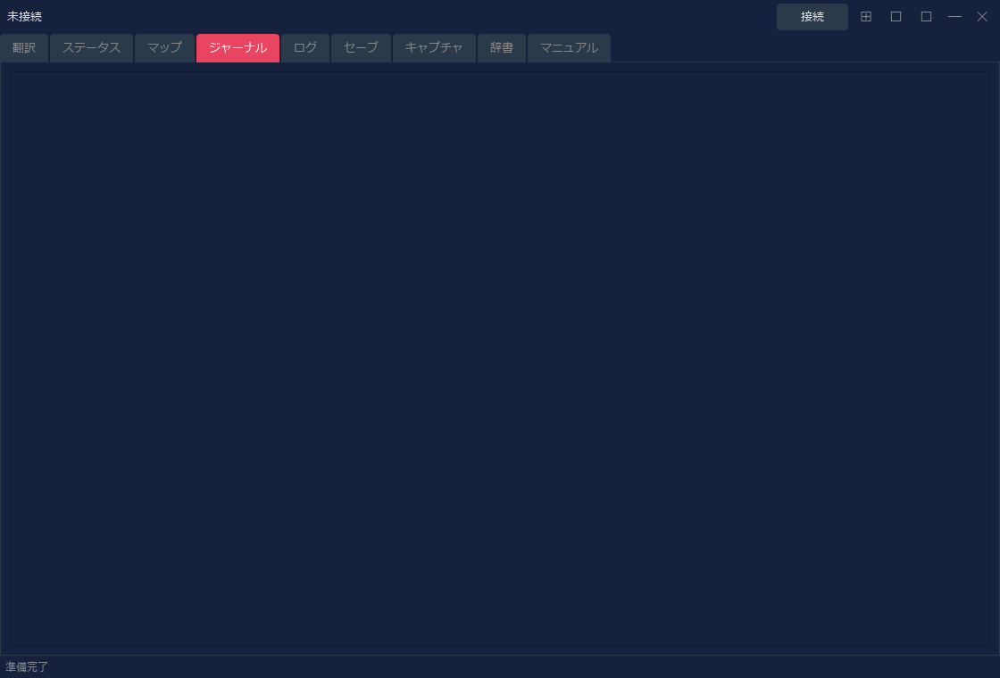

| 表示内容 | 説明 |
|----------|------|
| 日付・見出し | ジャーナル項目の日付や概要を表示します。 |
| 本文 | Logbook の本文を日本語で表示します。 |
| 更新 | ゲーム内でジャーナルが更新されると、Assist 側の表示も更新されます。 |

### ログタブ

Assist が表示した翻訳を履歴として確認するタブです。見逃した文章を後から読み返す用途に向いています。

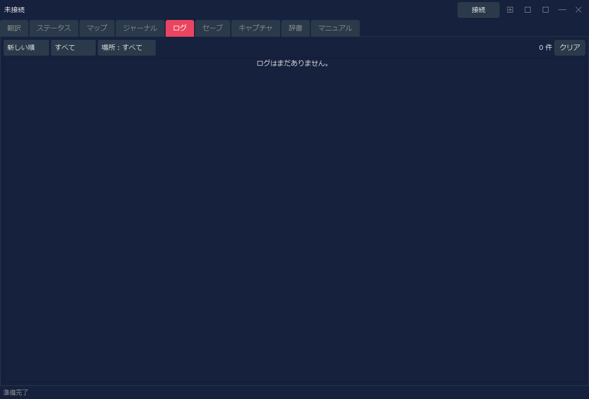

| 操作 | 説明 |
|------|------|
| 並び順 | 新しい順 / 古い順を切り替えます。 |
| フィルタ | 種別や場所でログを絞り込みます。 |
| クリア | 表示中のログを消去します。 |

### セーブタブ

Arena のセーブスロットとバックアップを管理するタブです。復元前の自動バックアップなど、セーブデータ操作を補助します。

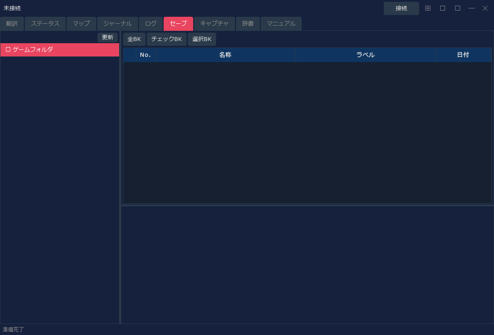

| 操作 | 説明 |
|------|------|
| スロット一覧 | Arena のセーブスロットを一覧表示します。 |
| バックアップ | 選択したセーブをバックアップします。 |
| 復元 | バックアップからセーブデータを戻します。 |
| 削除 | 不要なバックアップやセーブを削除します。 |

### キャプチャタブ

`📷` ボタンで保存したスクリーンショットを確認するタブです。レイアウトモード中に撮った画像もここから開けます。

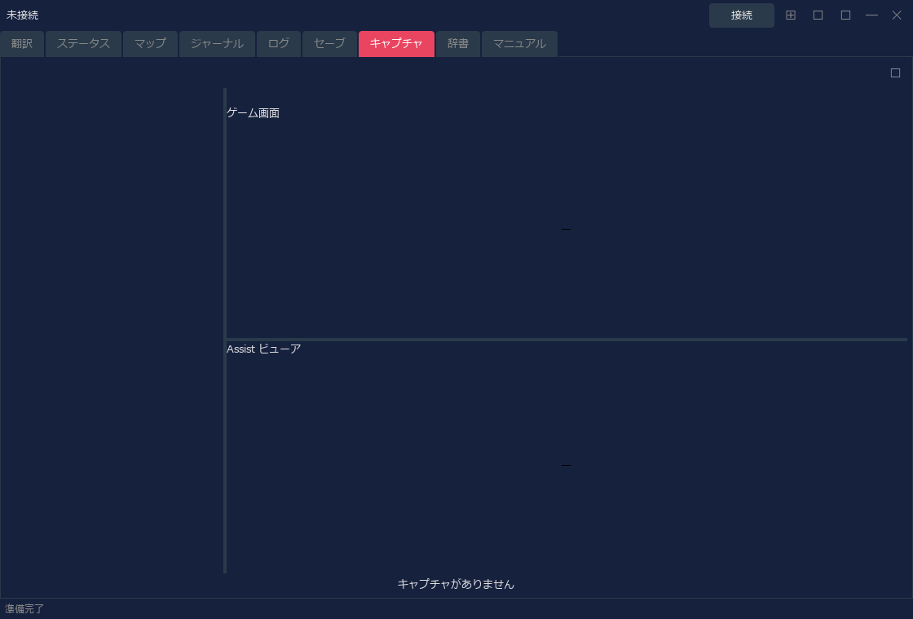

| 操作 | 説明 |
|------|------|
| 一覧 | 保存済みキャプチャを表示します。 |
| プレビュー | 選択した画像を確認します。 |
| ロック | 残したい画像を削除対象から守ります。 |
| 削除 | 選択画像または不要な画像を削除します。 |

### 辞書タブ

Assist が持つ翻訳辞書とダンジョンテキストを検索するタブです。ゲーム内で出てきた単語や文章の確認に使えます。

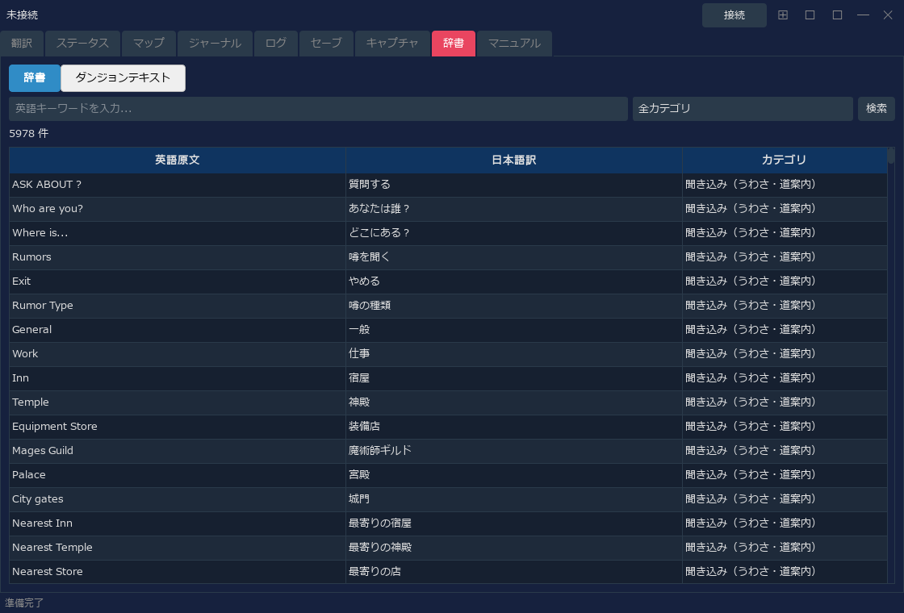

| 表示モード | 説明 |
|------------|------|
| 辞書 | 英語キーワード、日本語訳、カテゴリで検索します。 |
| ダンジョンテキスト | INF 由来のダンジョン文章を検索・確認します。 |

### マニュアルタブ

Arena の基本操作やシステム説明を日本語で確認できるタブです。ゲーム中に操作や用語を確認したいときに使います。

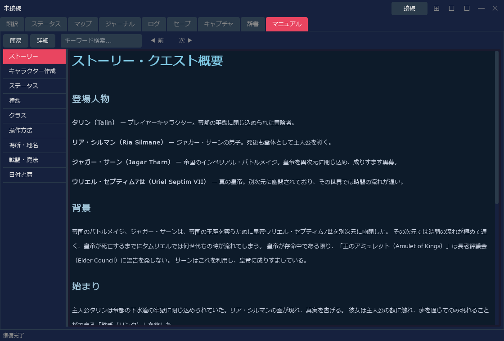

| 操作 | 説明 |
|------|------|
| 簡易 / 詳細 | 表示内容の粒度を切り替えます。 |
| キーワード検索 | マニュアル内を検索します。 |
| 左側リスト | ストーリー、キャラクター作成、操作方法、戦闘などの章を切り替えます。 |

---

## 基本的な使用手順

1. Arena を起動します。
2. RTESArenaAssist を起動します。
3. 初回起動時は、言語と Arena フォルダを指定して翻訳ファイルを生成します。
4. Assist 右上の `接続` を押して Arena / DOSBox に接続します。
5. `⊞` を押してレイアウトモードに入ります。
6. 普段はレイアウトモードのまま、翻訳タブ、マップタブ、ジャーナルタブ、ログタブを切り替えて使います。
7. 画面を残したいときは `📷` でキャプチャします。
8. 終了時は `⊞` でレイアウトモードを終了してから、必要に応じて `切断` します。

レイアウトモードの表示サイズ、配置形式、翻訳パネル、キャプチャ保存先などは、設定ダイアログから調整できます。
