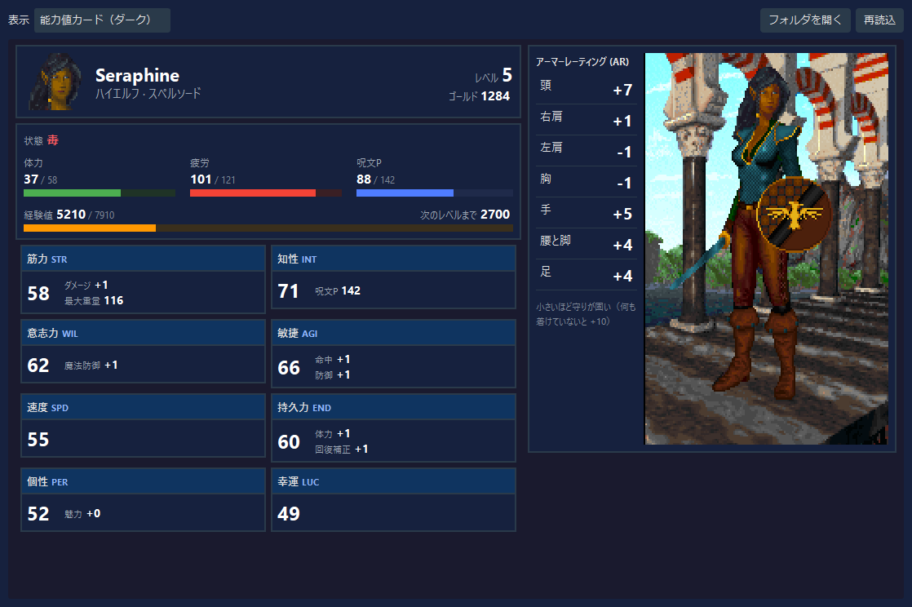
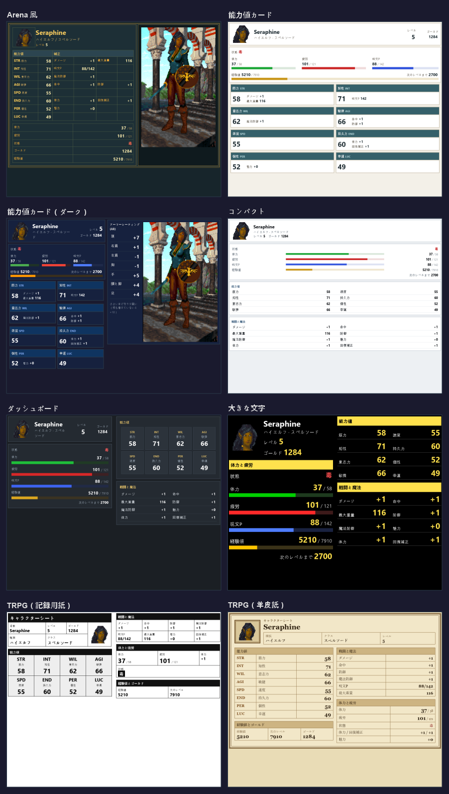

# RTESArenaAssist キャラクターシートガイド

対象は `v0.2.5`（ベータ版）時点の Assist アプリです。

キャラクターシートは、ステータスを任意のデザインで表示する機能です。ステータスタブのほか、翻訳タブのステータス画面・
能力値の割り振りでも、選んだデザインで表示します。
デザインは HTML のファイル（テンプレート）で決まり、同梱のデザインから選ぶほか、自分で作ることもできます。能力値のほか、
能力値の補正前の値と増減値、キャラクターの状態、部位ごとのアーマーレーティング、顔と全身像、選択したポーションの所持数
なども表示できます。

アプリのマニュアルタブの「Assist」にも、同じ説明を表示言語（日本語・英語・スペイン語・ドイツ語・フランス語・イタリア語・ロシア語）で載せています。

## 目次

- [表示の切り替え](#表示の切り替え)
- [同梱のデザイン](#同梱のデザイン)
- [自作のキャラクターシート](#自作のキャラクターシート)
  - [置き場所](#置き場所)
  - [使える HTML](#使える-html)
- [書き方](#書き方)
- [値の一覧](#値の一覧)
- [見出しの一覧](#見出しの一覧)
- [画像](#画像)
- [書き方の例](#書き方の例)
- [うまく表示されない時](#うまく表示されない時)

## 表示の切り替え

ステータスタブの上の「表示」で、「標準」（これまでの表示）か、キャラクターシートのデザインを選びます。
選んだ表示は、次に起動した時も使われます。



- 翻訳タブのステータス画面・能力値の割り振り（キャラクター作成とレベルアップ）でも、ここで選んだ表示が使われます。
- 値は Assist がゲームから読み取っている値で、「標準」の表示と同じです。キャラクターシートは表示だけで、ゲームの値は
  変えません（チート設定による値の変更は「標準」の表示で行います）。
- 表示されるのは、ゲームに接続してステータスが表示される場面だけです。

## 同梱のデザイン

同梱のデザインは 8 種です。下の画像は、すべて同じ例の値で表示したものです（1920×1080 のレイアウトモードの翻訳タブと同じ広さで表示し、半分に縮めています）。



| デザイン | 内容 |
|----------|------|
| Arena 風 | ゲームのステータス画面に近い並び。能力値の行に補正値、右に全身像 |
| 能力値カード | 能力値ごとの札に、その能力値で決まる補正値を並べる（筋力＝ダメージ・最大重量 など、ゲームのステータス画面と同じ組） |
| 能力値カード（ダーク） | Assist の暗い画面に合わせ、能力値の現在値・増減値・補正前の値、部位ごとのアーマーレーティング、全身像、選択したポーションの所持数を並べたもの |
| コンパクト | 小さな字で 1 ページに詰めたもの。小さい窓向け |
| ダッシュボード | 暗い色の札。体力・疲労・呪文ポイント・経験値を目盛りで表示 |
| 大きな文字 | 黒地に白と黄の大きな字 |
| TRPG（記録用紙） | 白黒の記録用紙 |
| TRPG（羊皮紙） | 羊皮紙の色と明朝の字 |

- 同梱のデザインは、1920×1080 のレイアウトモードの翻訳タブ・ステータスタブに、スクロールせずに収まるように作っています。
- 窓の幅が狭いと横のスクロールが出るデザインがあります（能力値カード（ダーク）は幅 約 740px 未満、Arena 風と
  ダッシュボードは約 540px 未満）。小さい窓では「コンパクト」が向いています。
- 目盛りの色は、ゲームの画面の顔の横の棒と同じ色合いです（体力＝緑・疲労＝赤・呪文ポイント＝青）。

## 自作のキャラクターシート

### 置き場所

ステータスタブの「フォルダを開く」を押すと、自作のキャラクターシートを置くフォルダが開きます。

- 場所は `RTESArenaAssist.exe` と同じ場所の `character_sheets` フォルダです。
- 初めて開く時にフォルダを作り、同梱のデザインの写しを置きます（既にあるファイルは上書きしません）。写しを書き換えて
  使うのが簡単です。
- フォルダの `.html` ファイルが「表示」の一覧に出ます。一覧の名前は、ファイルの `<title>` の文字（無ければファイル名）に
  「（フォルダ）」を付けたものです。
- ファイルを書き換えた後は、ステータスタブの「再読込」を押します。
- 文字コードは UTF-8 で保存します。

### 使える HTML

表示には、ブラウザではなく Qt の簡易 HTML 表示を使います（インターネットには接続しません）。

- 使えるもの: 表（`table`）、文字の色・大きさ・太さ・字体、背景色、枠線（`border`・`border-collapse`）、余白
  （`padding`・`margin`）、画像（`img`）、`<style>` の中のクラスの指定 など。詳しくは Qt の
  [Supported HTML Subset](https://doc.qt.io/qt-6/richtext-html-subset.html) を参照してください。
- 使えないもの: スクリプト、`flex`・`grid`、重ね合わせ（`position`）、角丸 など。配置は表で組みます。
- 同じフォルダの中の画像やスタイルシートは、相対パスで使えます（例: ``）。フォルダの外のファイルや
  インターネット上のファイルは読みません。リンクは開きません。
- 幅 100% の表は、すべての列に % で幅を書くと崩れにくくなります。

## 書き方

HTML の中に次の書き方を入れると、その場所に値が入ります。

| 書き方 | 意味 |
|--------|------|
| `{{key}}` | 値（[値の一覧](#値の一覧)）。値がまだ読めていない時は「—」 |
| `{{label.key}}` | 見出し（[見出しの一覧](#見出しの一覧)）。表示言語の訳が入る |
| `{{img.face}}` / `{{img.body}}` | 顔・全身像の画像（[画像](#画像)）。`` の形で使う |
| `{{#if key}}` … `{{else}}` … `{{/if}}` | key の値が読めている時だけ前の部分を、読めていない時は `{{else}}` の後を出す。`{{else}}` は省ける。入れ子にできる。`0` も読めている値 |

- 知らないキーは `[key?]` と出ます（綴りの誤りに気付けるように）。対になっていない `{{else}}` / `{{/if}}` は
  `[else?]` / `[/if?]` と出ます。
- `{{ key }}` のように括弧の内側に空白があっても構いません。
- HTML のコメント（`<!-- … -->`）の中には値を入れません。同梱のデザインの先頭のコメントに、キーの一覧があります。

## 値の一覧

例は、上の画像と同じ例の値です。

### 名前・種族・クラスなど

| キー | 内容 | 例 |
|------|------|----|
| `name` | 名前 | Seraphine |
| `race` / `race_en` | 種族（表示言語 / 英語） | ハイエルフ / High Elf |
| `class` / `class_en` | クラス（表示言語 / 英語） | スペルソード / Spellsword |
| `level` | レベル | 5 |
| `gold` | ゴールド | 1284 |

### 能力値と補正値

| キー | 内容 | 例 |
|------|------|----|
| `str` `int` `wil` `agi` `spd` `end` `per` `luc` | 現在の能力値（筋力・知性・意志力・敏捷・速度・持久力・個性・幸運） | 58 |
| `str_base` `int_base` `wil_base` `agi_base` `spd_base` `end_base` `per_base` `luc_base` | 補正前の能力値（通常プレイ中、現在値と異なる時だけ値がある） | 50 |
| `str_change` `int_change` `wil_change` `agi_change` `spd_change` `end_change` `per_change` `luc_change` | 現在値から補正前の値を引いた差。増加は `+8`、減少は `-8` のように符号付き（差がある時だけ値がある） | +8 |
| `damage` | ダメージ | +1 |
| `max_kilos` | 最大重量 | 116 |
| `magic_def` | 魔法防御 | +1 |
| `to_hit` / `to_defend` | 命中 / 防御 | +1 / +1 |
| `health` | 体力の補正 | +1 |
| `heal_mod` | 回復補正 | +1 |
| `charisma` | 魅力 | +0 |
| `bonus_pts` | 割り振りの残り（キャラクター作成と能力値の割り振りの間だけ値がある） | 12 |

能力値が変化している時だけ、増減値と補正前の値を表示する例です。

```html
<span class="current">{{str}}</span>
{{#if str_change}}<span class="change">{{str_change}}<br>({{str_base}})</span>{{/if}}
```

`str_change` は変化が無い時には空なので、条件の中は表示されず、現在値だけが残ります。ほかの能力値も `str` を `int` などへ置き換えて同じように使えます。

### 体力・疲労・呪文ポイント・経験値

| キー | 内容 | 例 |
|------|------|----|
| `hp` / `hp_curr` / `hp_max` | 体力（「今/最大」の形 / 今 / 最大） | 37/58 / 37 / 58 |
| `fatigue` / `fatigue_curr` / `fatigue_max` | 疲労（同上） | 101/121 / 101 / 121 |
| `spell_pts` / `spell_pts_curr` / `spell_pts_max` | 呪文ポイント（同上） | 88/142 / 88 / 142 |
| `experience` | 経験値 | 5210 |
| `experience_next` | 次のレベルに要る経験値 | 7910 |
| `experience_to_next` | 次のレベルまでの残り | 2700 |

### 目盛り用の値

| キー | 内容 | 例 |
|------|------|----|
| `hp_pct` / `fatigue_pct` / `spell_pts_pct` | 今の値の割合（0〜100）。最大が 0 の時（魔法を使えないクラスの呪文ポイントなど）は値が無い | 64 / 83 / 62 |
| `experience_pct` | このレベルになってから次のレベルまでの進み具合（0〜100） | 27 |
| `hp_pct_rest` / `fatigue_pct_rest` / `spell_pts_pct_rest` / `experience_pct_rest` | 残り（100 − 割合） | 36 / 17 / 38 / 73 |

目盛りの描き方は、[書き方の例](#目盛り)を参照してください。

### 状態

| キー | 内容 | 例 |
|------|------|----|
| `condition` | 今の状態をすべて並べたもの。何も無い時は「健康」 | 毒 |
| `condition_bad` | 悪い状態だけ（病気・毒・酩酊・沈黙・麻痺・呪い・減退）。無い時は値が無い | 毒 |
| `condition_good` | よい効果だけ（透明・標的外・各種の耐性・浮遊・呪文吸収・呪文反射・呪文耐性・再生）。無い時は値が無い | （無し） |

- 状態の語は、ゲームのステータスの窓と同じ語です。
- 次の状態は、今は出しません: 瀕死、防護、病気の名前、強化された能力値、祝福。

### 部位ごとのアーマーレーティング

| キー | 部位 | 例 |
|------|------|----|
| `ar_head` | 頭 | +7 |
| `ar_shoulder_right` / `ar_shoulder_left` | 右肩 / 左肩 | +1 / -1 |
| `ar_chest` | 胸 | -1 |
| `ar_hands` | 手 | +5 |
| `ar_legs` | 腰と脚 | +4 |
| `ar_feet` | 足 | +4 |

- ゲームの装備画面（キャラクターシートの 2 ページ目）で体の横に出る数と同じもので、装備から計算した値です。
  小さいほど守りが固く、何も着けていないと +10 です。
- 計算: 10 − 防具（その部位）− 盾（盾が守る部位）− 装身具（全部位）− 敏捷による防御の補正。

### ポーションの個数

ゲームの装備一覧で、表示したいポーションの「シート」列をチェックします。ゲームにある鑑定済みの全15種類を選択できます。
初期状態では、体力回復・疲労回復・病気治療の3種類が選択されています。

| キー | 内容 | 例 |
|------|------|----|
| `potion_1_name` … `potion_15_name` | 選択したポーションの名前（表示言語） | 治癒のポーション |
| `potion_1_short` … `potion_15_short` | 選択したポーションの短い名前（表示言語。「のポーション」に相当する定型部分を除く） | 治癒 |
| `potion_1_count` … `potion_15_count` | 対応するポーションの所持数 | 4 |

- 番号は装備一覧で選択した順です。使っていない番号には値がありません。
- 同梱の「能力値カード（ダーク）」は大判表示のため、選択順の先頭6種類だけを表示します。自作HTMLでは15種類すべてのキーを使えます。
- 種類を確定できない未鑑定のポーションは選択できません。所持数を読めない時も値はありません。

## 見出しの一覧

`{{label.key}}` の `key` に使えるものです。表示言語の訳が入ります。

| key | 日本語の例 |
|-----|------------|
| `name` `race` `class` `level` `gold` `experience` | 名前・種族・クラス・レベル・ゴールド・経験値 |
| `str` … `luc` | 筋力 … 幸運 |
| `str_code` … `luc_code` | STR … LUC |
| `damage` `max_kilos` `magic_def` `to_hit` `to_defend` `health` `heal_mod` `charisma` `spell_pts` `bonus_pts` | ダメージ・最大重量・魔法防御・命中・防御・体力・回復補正・魅力・呪文P・BONUS PTS |
| `hp` `fatigue` | 体力・疲労 |
| `experience_next` `experience_to_next` | 次のレベル・次のレベルまで |
| `condition` | 状態 |
| `ar_head` `ar_shoulder_right` `ar_shoulder_left` `ar_chest` `ar_hands` `ar_legs` `ar_feet` | 頭・右肩・左肩・胸・手・腰と脚・足 |
| `title` | キャラクターシート |
| `section_attributes` `section_combat` `section_vitals` `section_record` `section_armor` `section_potions` | 能力値・戦闘と魔法・体力と疲労・経験値とゴールド・アーマーレーティング (AR)・ポーション |
| `col_value` `col_modifier` `col_base` | 値・補正・補正前 |
| `armor_note` | 小さいほど守りが固い（何も着けていないと +10） |

## 画像

| キー | 内容 | 大きさ |
|------|------|--------|
| `img.face` | 顔（ゲームの画面の下に出る顔） | 80×70 |
| `img.body` | ステータス画面の姿（装備も重ねる） | 300×480 |

- お使いの Arena のファイルから作ります（Assist は Arena の画像を同梱していません）。作れない時は、同じ大きさの透明な
  画像になります。
- `width` / `height` を書くと、その大きさで表示します（点の粗い絵のまま、ぼかさずに拡大・縮小します）。
  整数倍（例: 顔を `width="160" height="140"`）にするときれいに見えます。

## 書き方の例

### 最小の例

```html
<!DOCTYPE html>
<html>
<head>
<meta charset="utf-8">
<title>My sheet</title>
<style>
  body { background-color: #1a1a2e; color: #e0e0e0;
         font-family: "Segoe UI", "Yu Gothic UI", sans-serif; }
  .v   { font-weight: bold; }
</style>
</head>
<body>
<table width="100%" cellspacing="0" cellpadding="6">
<tr>
  <td width="90"></td>
  <td><span class="v">{{name}}</span><br>{{race}} / {{class}}<br>{{label.level}} {{level}}</td>
</tr>
</table>
<table width="100%" cellspacing="0" cellpadding="4">
<tr><td width="50%">{{label.str}}</td><td width="50%" align="right"><span class="v">{{str}}</span></td></tr>
<tr><td>{{label.int}}</td><td align="right"><span class="v">{{int}}</span></td></tr>
<tr><td>{{label.hp}}</td><td align="right"><span class="v">{{hp}}</span></td></tr>
</table>
</body>
</html>
```

### 割り振りの間だけ出す

```html
{{#if bonus_pts}}<p>{{label.bonus_pts}}: {{bonus_pts}}</p>{{/if}}
```

### 悪い状態を赤で出す

```html
<p>{{label.condition}}:
{{#if condition_bad}}<span style="color: #ff5050;">{{condition}}</span>{{else}}{{condition}}{{/if}}</p>
```

### 目盛り

```html
{{#if hp_pct}}
<table width="100%" cellspacing="0" cellpadding="0" style="border-collapse: collapse; font-size: 1px;">
<tr>
  <td width="{{hp_pct}}%" bgcolor="#4caf50" style="padding-top: 4px; padding-bottom: 4px;"></td>
  <td width="{{hp_pct_rest}}%" bgcolor="#1f3326"></td>
</tr>
</table>
{{/if}}
```

- 2 つの升の両方に幅を書きます（片方だけだと、割合が 0 の時に満タンに見えます）。
- 升は空にして、高さは上下の余白（`padding`）で出します。表の字の大きさを小さく（`font-size: 1px`）しておくと、
  空の升の高さを抑えられます。

## うまく表示されない時

| 症状 | 確かめること |
|------|--------------|
| `[key?]` と出る | キーの綴り（[値の一覧](#値の一覧)・[見出しの一覧](#見出しの一覧)） |
| 「—」と出る | その値がまだ読めていません（キャラクター作成の途中など） |
| 一覧に出ない | ファイルの拡張子が `.html` か、`character_sheets` フォルダに置いたか。置いた後に「再読込」を押したか |
| 配置が崩れる | 使えない書き方（`flex`・`grid` など）を使っていないか。配置は表で組む |
| 画像が出ない | 画像のファイルが `character_sheets` フォルダの中にあるか（外のファイルは読みません） |
| 文字化けする | ファイルを UTF-8 で保存したか |
