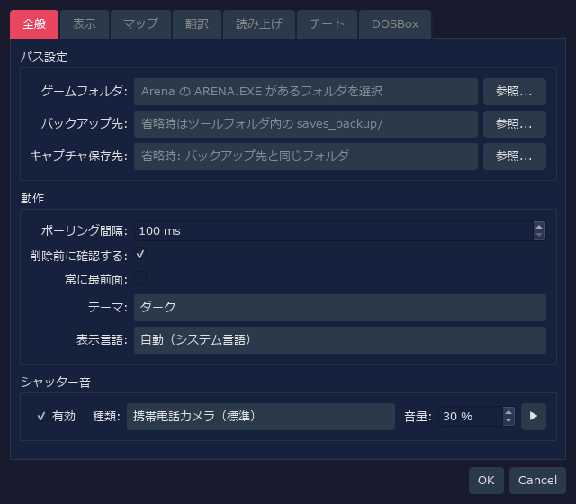
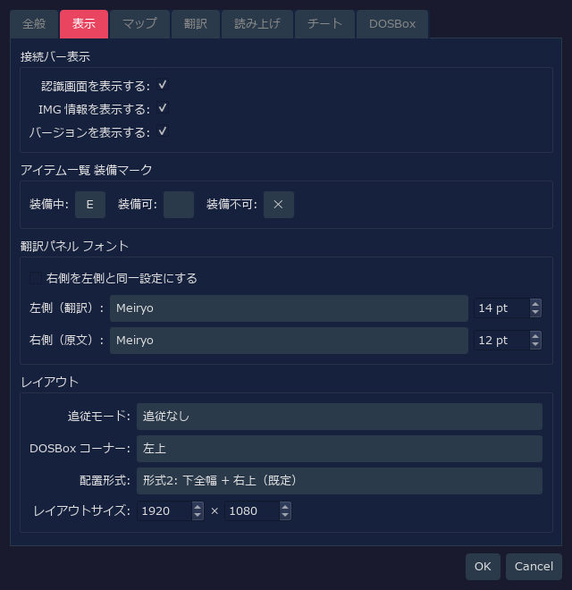
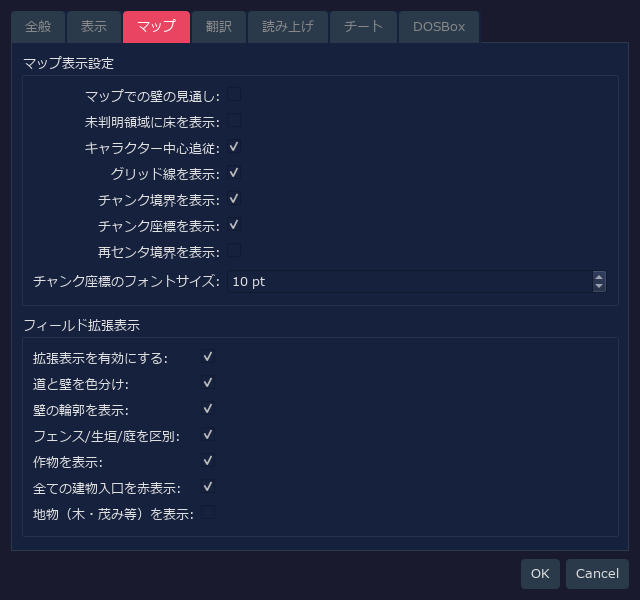
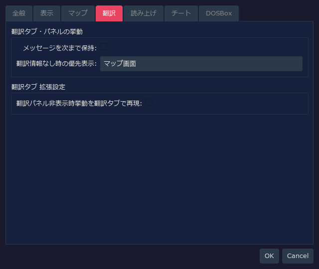
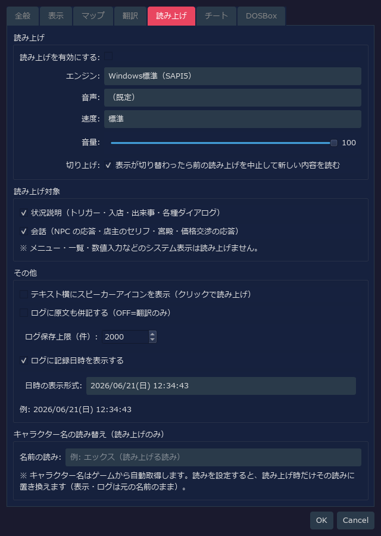
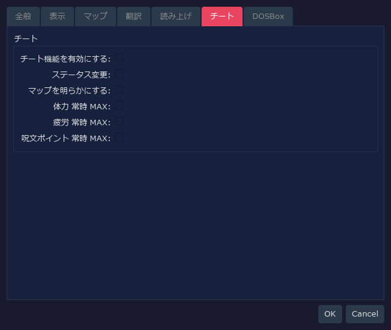
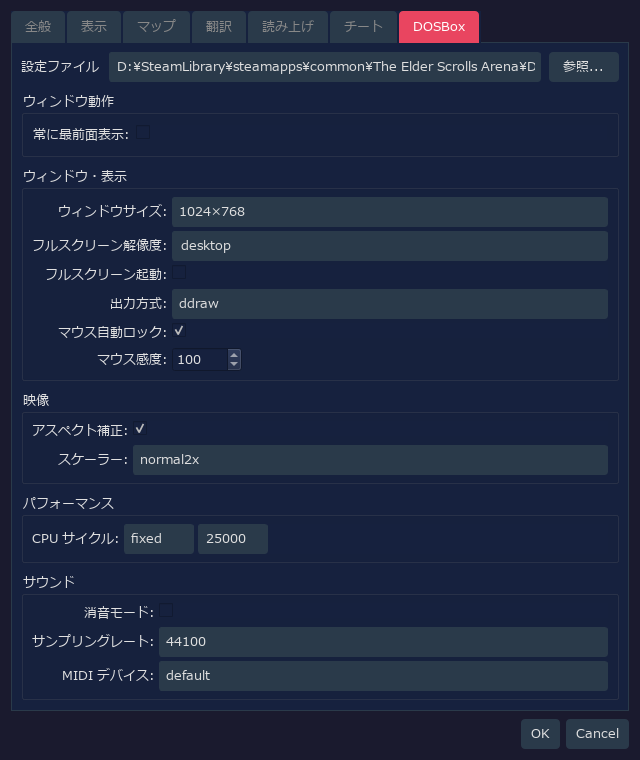

# RTESArenaAssist — 設定ダイアログ詳細ガイド

RTESArenaAssist の設定ダイアログにある各タブのキャプチャと、各 UI 要素の説明を掲載しています。

対象は `v0.1.5+b81` 時点の設定ダイアログです。スクリーンショットは初期設定の状態で、テーマは既定の「ダーク」です。各タブは、内容が途中で切れない高さまで広げて撮影しています。

DOSBox タブの値は、Assist 側の設定ファイルだけでなく、既定パスの `arena.conf` を読み取った結果も反映されます。そのため、利用環境の `arena.conf` が異なる場合は表示値も変わります。

---

## 目次

- [全般タブ](#全般タブ)
  - [パス設定](#パス設定)
  - [動作](#動作)
  - [シャッター音](#シャッター音)
- [表示タブ](#表示タブ)
  - [接続バー表示](#接続バー表示)
  - [アイテム一覧 装備マーク](#アイテム一覧-装備マーク)
  - [翻訳パネル フォント](#翻訳パネル-フォント)
  - [レイアウト](#レイアウト)
- [マップタブ](#マップタブ)
  - [マップ表示設定](#マップ表示設定)
  - [フィールド拡張表示](#フィールド拡張表示)
- [翻訳タブ](#翻訳タブ)
  - [翻訳タブ / パネルの挙動](#翻訳タブ--パネルの挙動)
  - [翻訳タブ 拡張設定](#翻訳タブ-拡張設定)
- [読み上げタブ](#読み上げタブ)
  - [読み上げ](#読み上げ)
  - [読み上げ対象](#読み上げ対象)
  - [その他 / ログ](#その他--ログ)
  - [キャラクター名の読み替え](#キャラクター名の読み替え)
- [チートタブ](#チートタブ)
- [DOSBox タブ](#dosbox-タブ)
  - [設定ファイル / ウィンドウ動作](#設定ファイル--ウィンドウ動作)
  - [ウィンドウ・表示](#ウィンドウ表示)
  - [映像](#映像)
  - [パフォーマンス](#パフォーマンス)
  - [サウンド](#サウンド)

---

## 全般タブ

パス、基本動作、シャッター音を設定するタブです。

### パス設定

| 表示ラベル | 初期値 | 説明 |
|-----------|--------|------|
| `ゲームフォルダ:` | 空 | Arena の `ARENA.EXE` やセーブファイルがあるフォルダ。未設定時は、セーブ管理やゲームデータ読み取りを利用できない |
| `バックアップ先:` | 空 | セーブバックアップの保存先。空の場合は、ツール設定ファイル横の `saves_backup/` を使用する |
| `キャプチャ保存先:` | 空 | スクリーンショットの保存先。空の場合は、バックアップ先と同じフォルダを使用する |
| `参照...` | - | 各フォルダを選択する |

### 動作

| 表示ラベル | 初期値 | 説明 |
|-----------|--------|------|
| `ポーリング間隔:` | `100 ms` | DOSBox 画面やメモリ状態を監視する周期。短いメッセージを拾いやすくするため、初期値は短め |
| `削除前に確認する:` | ON | キャプチャやバックアップを削除するときに確認ダイアログを表示する |
| `常に最前面:` | OFF | Assist 本体ウィンドウを他のウィンドウより手前に表示する |
| `テーマ:` | ダーク | UI の配色テーマを選択する |
| `表示言語:` | 自動（システム言語） | UI 言語。空設定ではシステム言語をもとに自動判定され、変更はアプリ再起動後に反映される |

### シャッター音

| 表示ラベル | 初期値 | 説明 |
|-----------|--------|------|
| `有効` | ON | スクリーンショット保存時に効果音を再生する |
| `種類:` | 携帯電話カメラ（標準） | 再生するシャッター音。標準、短縮版、ダブル、高音強調、マイルドから選択できる |
| `音量:` | `30 %` | シャッター音の再生音量 |
| `▶` | - | 選択中のシャッター音を試聴する |

---

## 表示タブ

接続バー、アイテム一覧の装備マーク、翻訳パネルのフォント、レイアウトを設定するタブです。

### 接続バー表示

| 表示ラベル | 初期値 | 説明 |
|-----------|--------|------|
| `認識画面を表示する:` | ON | 接続バーに現在の認識画面名を表示する |
| `IMG 情報を表示する:` | ON | 接続バーに検出中の IMG 情報を表示する |
| `バージョンを表示する:` | ON | 接続バーやステータスバーにアプリのバージョンを表示する |

### アイテム一覧 装備マーク

| 表示ラベル | 初期値 | 説明 |
|-----------|--------|------|
| `装備中:` | `Ｅ` | 装備中アイテムの左端に表示する 1 文字マーク |
| `装備可:` | 空 | 装備可能アイテムのマーク。初期値は空なので何も表示しない |
| `装備不可:` | `✕` | 装備できないアイテムの左端に表示する 1 文字マーク |

### 翻訳パネル フォント

| 表示ラベル | 初期値 | 説明 |
|-----------|--------|------|
| `右側を左側と同一設定にする` | OFF | ON にすると、原文側のフォントとサイズを翻訳側と同じにする |
| `左側（翻訳）:` | アプリ既定 / `14 pt` | 翻訳文に使うフォントとサイズ。フォント名が未保存の場合は、実行環境のアプリ既定フォントが選ばれる |
| `右側（原文）:` | アプリ既定 / `12 pt` | 英語原文に使うフォントとサイズ。同期 OFF のため、翻訳側とは別に設定できる |

### レイアウト

| 表示ラベル | 初期値 | 説明 |
|-----------|--------|------|
| `追従モード:` | 追従なし | DOSBox と Assist のどちらかが移動したときに、もう一方を追従させるかを選ぶ |
| `DOSBox コーナー:` | 左上 | 一発配置やレイアウトモードで DOSBox を置く画面上の基準コーナー |
| `配置形式:` | 形式2: 下全幅 + 右上（既定） | DOSBox と Assist パネル領域の分割形式。形式2は右上と下全幅を使う標準レイアウト |
| `レイアウトサイズ:` | `1920 x 1080` | レイアウトモード時の全体キャンバスサイズ |

---

## マップタブ

探索マップとフィールド拡張表示を設定するタブです。

### マップ表示設定

| 表示ラベル | 初期値 | 説明 |
|-----------|--------|------|
| `マップでの壁の見通し:` | OFF | OFF では、壁の向こうの未確認領域をマップに記録しない。ON にすると Arena 原作に近く、壁越しの領域も記録される |
| `未判明領域に床を表示:` | OFF | OFF では判明済みセルだけ床色を表示し、未探索範囲の形を隠す。ON ではマップ全体を巻物地色で表示する |
| `キャラクター中心追従:` | ON | キャラクター移動時にマップを自動でキャラクター中心へ追従させる。停止中は手動パンできる |
| `グリッド線を表示:` | ON | セル境界のグリッド線を表示する |
| `チャンク境界を表示:` | ON | フィールドマップで 64 マス単位のチャンク境界を強調表示する |
| `チャンク座標を表示:` | ON | フィールドマップ上に各チャンク座標を表示し、位置把握を補助する |
| `再センタ境界を表示:` | OFF | フィールドマップの再センタ境界を破線で表示する。位置調査や確認用の補助表示 |
| `チャンク座標のフォントサイズ:` | `10 pt` | チャンク座標ラベルの文字サイズ |

### フィールド拡張表示

| 表示ラベル | 初期値 | 説明 |
|-----------|--------|------|
| `拡張表示を有効にする:` | ON | フィールドマップ拡張表示の親スイッチ。OFF にするとゲーム内自動マップに近い表示になる |
| `道と壁を色分け:` | ON | 通行できる道と、建物や壁など通行できない部分を別色で描き分ける |
| `壁の輪郭を表示:` | ON | 壁の輪郭や edge 地形を表示する |
| `フェンス/生垣/庭を区別:` | ON | フェンス、生垣、庭などの edge 系地形を接続線で区別する |
| `作物を表示:` | ON | トウモロコシや畑などの作物を専用色やマークで表示する |
| `全ての建物入口を赤表示:` | ON | 家、酒場、神殿、街門などの入口も赤く表示する。クリプト、塔、ダンジョン入口はこの設定に関わらず赤表示 |
| `地物（木・茂み等）を表示:` | OFF | 木、茂み、岩、墓、廃墟などを簡略マークで重ねる。数が多く地図が読みにくくなるため、初期値は OFF |

---

## 翻訳タブ

翻訳パネルや翻訳タブの補助表示を設定するタブです。

### 翻訳タブ / パネルの挙動

| 表示ラベル | 初期値 | 説明 |
|-----------|--------|------|
| `メッセージを次まで保持:` | OFF | トリガーやオブジェクト対話メッセージを、次のメッセージが来るまで翻訳パネルに残すかを指定する |
| `翻訳情報なし時の優先表示:` | マップ画面 | 探索中で翻訳文がないとき、翻訳タブ全域に何を表示するかを選ぶ。初期値ではマップ画面を優先する |

### 翻訳タブ 拡張設定

| 表示ラベル | 初期値 | 説明 |
|-----------|--------|------|
| `翻訳パネル非表示時挙動を翻訳タブで再現:` | OFF | ON にすると、翻訳パネルを隠したときと同じように、翻訳結果やダイアログメッセージを翻訳タブ側へ表示する。検証用の拡張設定 |

---

## 読み上げタブ

翻訳文の読み上げ、読み上げ対象、ログ表示、キャラクター名の読み替えを設定するタブです。

### 読み上げ

| 表示ラベル | 初期値 | 説明 |
|-----------|--------|------|
| `読み上げを有効にする:` | OFF | 翻訳文の読み上げ機能全体を有効化する |
| `エンジン:` | Windows標準（SAPI5） | 読み上げエンジンを選ぶ。VOICEVOX はローカルの VOICEVOX エンジンが起動している場合に選択できる |
| `音声:` | （既定） | 使用する SAPI 音声。空の場合は OS 側の既定音声を使う |
| `速度:` | 標準 | 読み上げ速度 |
| `音量:` | `100` | 読み上げ音量。0 から 100 の範囲で設定する |
| `切り上げ:` | ON | 表示が切り替わったら前の読み上げを中止し、新しい内容を読み上げる |

### 読み上げ対象

| 表示ラベル | 初期値 | 説明 |
|-----------|--------|------|
| `状況説明（トリガー・入店・出来事・各種ダイアログ）` | ON | トリガー、入店、出来事、各種ダイアログなど、状況を説明する文章を読み上げ対象にする |
| `会話（NPC の応答・店主のセリフ・宮殿・価格交渉の応答）` | ON | NPC の応答、店主のセリフ、宮殿、価格交渉の応答など、会話文を読み上げ対象にする |

メニュー、一覧、数値入力などのシステム表示は読み上げません。

### その他 / ログ

| 表示ラベル | 初期値 | 説明 |
|-----------|--------|------|
| `テキスト横にスピーカーアイコンを表示` | OFF | 表示テキストの横にクリック読み上げ用のスピーカーアイコンを出す |
| `ログに原文も併記する` | OFF | 翻訳ログに英語原文も併記する。OFF では翻訳のみを表示する |
| `ログ保存上限（件）:` | `2000` | 保存するログ件数の上限。超えた古いログは自動削除される |
| `ログに記録日時を表示する` | ON | ログ項目に記録日時を表示する |
| `日時の表示形式:` | `yyyy/MM/dd(aaa) HH:mm:ss` | ログ日時の表示フォーマット。プリセットまたはカスタム書式を選べる |

### キャラクター名の読み替え

| 表示ラベル | 初期値 | 説明 |
|-----------|--------|------|
| `名前の読み:` | 空 | ゲームから自動取得したキャラクター名を、読み上げ時だけ指定した読みに置き換える。表示とログには元の名前が残る |

---

## チートタブ

ゲーム内数値の書き換えや常時 MAX 系の補助機能を設定するタブです。

| 表示ラベル | 初期値 | 説明 |
|-----------|--------|------|
| `チート機能を有効にする:` | OFF | チート系機能全体の親スイッチ。これだけを ON にしても、サブ設定を ON にしない限り何も変えない |
| `ステータス変更:` | OFF | 能力値編集などのステータス変更を許可する |
| `マップを明らかにする:` | OFF | チート有効時にマップを全表示する |
| `体力 常時 MAX:` | OFF | チート有効時、現在体力が最大値より低ければ最大値へ戻す |
| `疲労 常時 MAX:` | OFF | チート有効時、現在疲労を最大値へ戻す |
| `呪文ポイント 常時 MAX:` | OFF | チート有効時、現在呪文ポイントを最大値へ戻す |

---

## DOSBox タブ

DOSBox の `arena.conf` を読み取り、ウィンドウ表示、映像、性能、音声を設定するタブです。

### 設定ファイル / ウィンドウ動作

| 表示ラベル | 初期値 | 説明 |
|-----------|--------|------|
| `設定ファイル` | 既定パスの `arena.conf` | DOSBox の設定ファイル。Assist 側の設定が空の場合、標準の Arena Steam 版配置を既定パスとして読む |
| `参照...` | - | 任意の `arena.conf` を選択する |
| `常に最前面表示:` | OFF | DOSBox ウィンドウを他のウィンドウより手前に表示する |

### ウィンドウ・表示

| 表示ラベル | 初期値 | 説明 |
|-----------|--------|------|
| `ウィンドウサイズ:` | `1024×768` | `windowresolution`。プリセットから選び、カスタム選択時は W/H の数値欄を編集する |
| `フルスクリーン解像度:` | `desktop` | `fullresolution`。フルスクリーン時の解像度を指定する |
| `フルスクリーン起動:` | OFF | `fullscreen`。DOSBox をフルスクリーンで起動するかを指定する |
| `出力方式:` | `ddraw` | `output`。DOSBox の描画出力方式 |
| `マウス自動ロック:` | ON | `autolock`。DOSBox 画面内にマウスを自動ロックする |
| `マウス感度:` | `100` | `sensitivity`。DOSBox 内のマウス感度 |

### 映像

| 表示ラベル | 初期値 | 説明 |
|-----------|--------|------|
| `アスペクト補正:` | ON | `aspect`。映像の縦横比を補正する |
| `スケーラー:` | `normal2x` | `scaler`。DOSBox の画面拡大フィルタ |

### パフォーマンス

| 表示ラベル | 初期値 | 説明 |
|-----------|--------|------|
| `CPU サイクル:` | `fixed 25000` | `cycles`。CPU エミュレーション速度を指定する。`fixed` の場合は右側の数値欄が有効になる |

### サウンド

| 表示ラベル | 初期値 | 説明 |
|-----------|--------|------|
| `消音モード:` | OFF | `nosound`。DOSBox の音声を無効化する |
| `サンプリングレート:` | `44100` | `rate`。ミキサーのサンプリングレート |
| `MIDI デバイス:` | `default` | `mididevice`。MIDI 再生に使用するデバイス |
